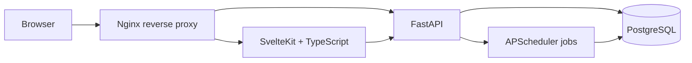

# BabyFoot

BabyFoot is a full-stack foosball league tracker for recording matches, ranking players with an Elo-style system, and exploring player statistics over time.

[Live demo](https://babyfoot.chamrai.fr) · [API docs](https://babyfoot.chamrai.fr/docs)

## Screenshots

Add current application screenshots in `docs/screenshots/` and keep these filenames so the README renders them automatically.


## Features

- Record foosball matches with flexible team composition and score validation.
- Track monthly, yearly, and overall leaderboards.
- Update player ratings with a custom Elo-style ranking system.
- Preserve per-game rating deltas so match history can explain how rankings changed.
- View player statistics including games played, wins, win rate, average scores, teammate performance, streaks, and match history.
- Snapshot rating history daily for historical charts and period-based leaderboards.

## Architecture



The application is split into four runtime services in Docker Compose:

- `frontend`: SvelteKit and TypeScript UI for dashboards, leaderboards, players, match creation, and match history.
- `fastapi`: FastAPI backend exposing REST endpoints under `/api`.
- `postgres`: PostgreSQL database seeded from `babyfoot.sql` on first container initialization.
- `nginx`: Public entry point that serves the frontend and proxies `/api`, `/docs`, `/redoc`, and health checks to FastAPI.

## Ranking System

BabyFoot uses a custom team Elo implementation in `backend/ranking/custom_elo.py`.

Team strength is calculated from the average rating of each team's players. After each match, the backend computes expected win probability, applies a margin-of-victory multiplier, scales the update by team size, and splits the rating delta across teammates. The system maintains separate `overall`, `yearly`, and `monthly` ratings, while storing per-player, per-game rating changes for auditability and UI hover details.

## Statistics And History

The backend exposes player match history, rating history, leaderboard data, and scoped player statistics. Statistics can be filtered by overall, yearly, or monthly periods. Rating history is stored in `players_rating_history`, while immediate current rankings live in `current_player_rank`.

## Scheduled Jobs

FastAPI starts an APScheduler background scheduler during application startup. The job `snapshot_daily_ratings_and_roll_periods` runs every day at 00:05 in the configured timezone, currently `Europe/Paris`. It writes daily rating snapshots for overall, monthly, and yearly rankings when ratings changed, resets monthly ratings on the first day of each month, and resets yearly ratings on January 1.

Startup also calls `ensure_current_period_ratings` so the application catches up if the scheduled rollover was missed while the service was down.

## Technical Decisions And Trade-Offs

- SvelteKit keeps the UI fast and typed while still allowing server-side route loading where it helps hide internal API calls from the browser.
- FastAPI was chosen for a small, explicit REST API with automatic OpenAPI documentation and straightforward request validation.
- PostgreSQL is used instead of a lighter embedded database because ranking history, per-game deltas, and period snapshots benefit from relational constraints and indexed queries.
- Docker Compose keeps local development and deployment close to production by running the frontend, backend, database, and proxy as separate services.
- Nginx centralizes routing so the browser can call the same origin for the UI and API.
- The rating system is intentionally custom rather than a black-box package so match updates can account for foosball-specific behavior such as team games, margin of victory, and monthly/yearly resets.

## Running Locally

Start the complete stack:

```bash
docker compose up --build
```

Then open:

- Application: `http://localhost:8080`
- API docs: `http://localhost:8080/docs`
- Health check: `http://localhost:8080/healthz`

The default database credentials are defined in `docker-compose.yml` and are intended for local development.

## Development

Backend:

```bash
uv sync
uv run uvicorn backend.main:app --reload
```

Frontend:

```bash
cd front-end
npm install
npm run dev
```

Useful environment variables:

- `DATABASE_URL`: SQLAlchemy database URL used by FastAPI.
- `TIMEZONE`: timezone for rating snapshots and period rollovers.
- `AUTO_POPULATE_IF_EMPTY`: whether the backend should populate an empty database from the configured source.
- `POPULATE_SOURCE_URL`: source URL used by the optional data population flow.
- `NAMES_PRIVACY_PASSWORD`: optional shared password that allows player names to be returned.
- `NAMES_VISIBLE_IPS`: optional comma-separated IP/CIDR allowlist that can see player names, for example `192.0.2.10,198.51.100.0/24`.
- `PUBLIC_API_BASE`: browser-visible API base for the SvelteKit app.
- `INTERNAL_API_BASE`: server-side API base used by SvelteKit inside Docker.

When either `NAMES_PRIVACY_PASSWORD` or `NAMES_VISIBLE_IPS` is set, player names are replaced with placeholders unless the request comes from an allowlisted IP or includes the password in the `X-Names-Password` header or `names_password` cookie.

## Testing

Backend tests cover game payload validation, same-day rating recalculation, rating rebuilds, period rollovers, daily snapshot jobs, and the custom Elo implementation.

```bash
uv run --with pytest pytest backend/tests
```

Frontend quality checks:

```bash
cd front-end
npm run check
npm run lint
```

## Repository Layout

```text
backend/                FastAPI app, SQLModel models, API routers, ranking logic, jobs
front-end/              SvelteKit application
nginx/                  Reverse proxy configuration
docker/postgres/init/   PostgreSQL initialization scripts
babyfoot.sql            Seed data imported by PostgreSQL on first startup
docker-compose.yml      Local full-stack runtime
```

## GitHub Profile

Pin `Babyfoot` on your GitHub profile and place it above academic projects so visitors see it as a complete full-stack application first.
